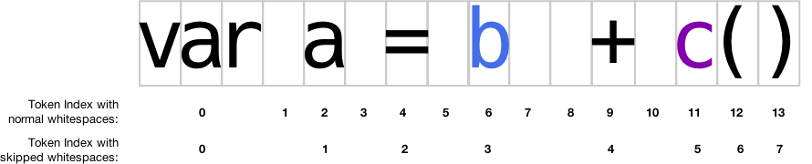

[](https://nodei.co/npm/antlr4-c3/)

[](https://travis-ci.org/mike-lischke/antlr4-c3)

# antlr4-c3 The ANTLR4 Code Completion Core

This project contains a grammar agnostic code completion engine for ANTLR4 based parsers. The c3 engine is able to provide code completion candidates useful for editors with ANTLR generated parsers, independent of the actual language/grammar used for the generation.

The original implementation is provided as a node module, and is written in TypeScript. A port to Java is available under `ports/java`. Implementations under the `ports` folder might not be up to date compared to the Typescript version.

# Abstract

There have been quite a number of requests over the past years for getting support from ANTLR to create a code completion implementation, but so far that turned out as an isolated task with only custom solutions. This library aims to provide a common infrastructure for code completion implementations in a more general way, so that people can share their solutions and provide others with ideas to solve specific problems related to that.

The c3 engine implementation is based on an idea presented a while ago under [Universal Code Completion using ANTLR3](https://soft-gems.net/universal-code-completion-using-antlr3/). There a grammar was loaded into a memory structure so that it can be walked through with the current input to find a specific location (usually the caret position) and then collect all possible tokens and special rules, which then describe the possible set of code completion candidates for that position. With ANTLR4 we no longer need to load a grammar, because the grammar structure is now available as part of a parser (via the ATN - [Augmented Transition Network](https://en.wikipedia.org/wiki/Augmented_transition_network)). The ANTLR4 runtime even provides the [LL1Analyzer](https://github.com/antlr/antlr4/blob/master/runtime/Java/src/org/antlr/v4/runtime/atn/LL1Analyzer.java) class, which helps with retrieving follow sets for a given ATN state, but has a few shortcomings and is in general not easy to use.

With the Code Completion Core implementation things become a lot easier. In the simplest setup you only give it a parser instance and a caret position and it will return the candidates for it. Still, a full code completion implementation requires some support code that we need to discuss first before we can come to the actual usage of the c3 engine.

# A Code Completion Breakdown

For showing possible symbols in source code you obviously need a source for all available symbols at the given position. Providing them is usually the task of a symbol table. Its content can be derived from your current source code (with the help of a parser + a parse listener). More static parts (like runtime functions) can be loaded from disk or provided by a hard coded list etc. The symbol table can then answer your question about all symbols of a given type that are visible from a given position. The position usually corresponds to a specific symbol in the symbol table and the structure then allows to easily get visible symbols. The c3 engine comes with a small symbol table implementation, which is however not mandatory to use the library, but instead provides an easy start, if you don't have an own symbol table class already.

While the symbol table provides symbols of a given type, we need to find out which type is actually required. This is the task of the c3 engine. In its simplest setup it will return only keywords (and other lexer symbols) that are allowed by the grammar for a given position (which is of course the same position used to find the context for a symbol lookup in your symbol table). Keywords are a fixed set of words (or word sequences) that usually don't live in a symbol table. You can get the actual text strings directly from the parser vocabulary. The c3 engine only returns the lexer tokens for them.

In order to also get other types like variables or class names you have to do 2 steps:

* Identify entities in your grammar which you are interested in and put them into own rules. More about this below.
* Tell the engine in which parser rules you are particularly interested. It will then return those to you instead of the lexer tokens they are made of.

Let's consider a grammar which can parse simple expressions like:

```typescript
var a = b + c()
```

Such a grammar could look like:

```antlr
grammar Expr;
expression: assignment | simpleExpression;

assignment: (VAR | LET) ID EQUAL simpleExpression;

simpleExpression
    : simpleExpression (PLUS | MINUS) simpleExpression
    | simpleExpression (MULTIPLY | DIVIDE) simpleExpression
    | variableRef
    | functionRef
;

variableRef: ID;
functionRef: ID OPEN_PAR CLOSE_PAR;

VAR: [vV] [aA] [rR];
LET: [lL] [eE] [tT];

PLUS: '+';
MINUS: '-';
MULTIPLY: '*';
DIVIDE: '/';
EQUAL: '=';
OPEN_PAR: '(';
CLOSE_PAR: ')';
ID: [a-zA-Z] [a-zA-Z0-9_]*;
WS: [ \n\r\t] -> channel(HIDDEN);
```

You can see the 2 special rules `variableRef` and `functionRef`, which mostly consist of the `ID` lexer rule. We could have instead used a single `ID` reference in the `simpleExpression` rule. However, this is where your domain knowledge about the language comes in. By making the two use cases explicit you can now exactly tell what to query from your symbol table. As you see we are using parser rules to denote entity types, which is half of the magic here.

The code completion core can return parser rule indexes (as created by ANTLR4 when it generated your files). With a returned candidate `ExprParser.RULE_variableRef` you know that you have to ask your symbol for all visible variables (or functions if you get back `ExprParser.RULE_functionRef`). It's easy to see how this applies to much more complex grammars. The principle is always the same: create an own parser rule for your entity references. If you have an SQL grammar where you drop a table write your rules so:

```mysql
dropTable: DROP TABLE tableRef;
tableRef: ID;
```

instead of:

```mysql
dropTable: DROP TABLE ID;
```

Then tell the c3 engine that you want to get back `tableRef` if it is a valid candidate at a given position.

# Getting Started
With this knowledge we can now look at a simple code example that shows how to use the engine. For further details check the unit tests for this node module (under the test/ folder).

```typescript
let inputStream = new ANTLRInputStream("var c = a + b()");
let lexer = new ExprLexer(inputStream);
let tokenStream = new CommonTokenStream(lexer);

let parser = new ExprParser(tokenStream);
let errorListener = new ErrorListener();
parser.addErrorListener(errorListener);
let tree = parser.expression();

let core = new c3.CodeCompletionCore(parser);
let candidates = core.collectCandidates(0);
```

This is a pretty standard parser setup here. It's not even necessary to actually parse the input. But the c3 engine needs a few things for its work:

* the ATN of your parser class
* the tokens from your input stream
* vocabulary and rule names for debug output

All these could be passed in individually, but since your parser contains all of that anyway and we need a parser for predicate execution, the API has been designed to take a parser instead (predicates work however only if written for the Javascript/Typescript target). In real world applications you will have a parser anyway (e.g. for error checking), which is perfect as ATN and input provider for the code completion core. But keep in mind: whatever parser you pass in it must have a fully set up token stream. It's not required that it parsed anything before calling the code completion engine and the current stream positions don't matter either.

The returned candidate collection contains fields for lexer tokens (mostly keywords, but also other tokens if they are not on the ignore list) and parser rule indexes. This collection is defined as:

```typescript
class CandidatesCollection {
    public tokens: Map<number, TokenList>;
    public rules: Map<number, CandidateRule>;
};
```

where the map keys are the lexer tokens and the rule indices, respectively. Both can come with additional values, which you may or may not use for your implementation.

For parser rules the value includes a `startTokenIndex`, which reflects the index of the starting token within the evaluated rule. This allows consumers to determine the range of tokens that should be replaced or matched against when resolving symbols for your rule. The value also contains a rule list which represents the call stack at which the given rule was found during evaluation. This allows consumers to determine a context for rules that are used in different places.

For the lexer tokens the list consists of further token ids which directly follow the given token in the grammar (if any). This allows you to show **token sequences** if they are always used together. For example consider this SQL rule:

```antlr
createTable: CREATE TABLE (IF NOT EXISTS)? ...;
```

Here, if a possible candidate is the `IF` keyword, you can also show the entire `IF NOT EXISTS` sequence to the user (and let him complete all 3 words in one go in the source code). The engine will return a candidate entry for `IF` with a token list containing `NOT` and `EXISTS`. This list will of course update properly when the user comes to `NOT`. Then you will get a candidate entry for `NOT` and an additional list consisting of just `EXISTS`.

Essential for getting any rule index, which you can use to query your symbol table, is that you specify those you want in the `CodeCompletionCore.preferredRules` field before running `CodeCompletionCore.collectCandidates()`.

The final step to get your completion strings is usually something like this:

```typescript
let keywords: string[] = [];
for (let candidate of candidates.tokens) {
    keywords.push(parser.vocabulary.getDisplayName(candidate[0]));
}

let symbol = ...; // Find the symbol that covers your caret position.
let functionNames: string[] = [];
let variableNames: string[] = [];
for (let candidate of candidates.rules) {
  switch (candidate[0]) {
    case ExprParser.RULE_functionRef: {
      let functions = symbol.getSymbolsOfType(c3.FunctionSymbol);
      for (function of functions)
        functionNames.push(function.name);
      break;
    }

    case ExprParser.RULE_variableRef: {
      let variables = symbol.getSymbolsOfType(c3.VariableSymbol);
      for (variable of variables)
        functionNames.push(variable.name);
      break;
    }
  }
}

// Finally combine all found lists into one for the UI.
// We do that in separate steps so that you can apply some ordering to each of your sub lists.
// Then you also can order symbols groups as a whole depending their importance.
let candidates: string[] = [];
candidates.push(...keywords);
candidates.push(...functionNames);
candidates.push(...variableNames);
```

# Fine Tuning
## Ignored Tokens
As mentioned above in the base setup the engine will only return lexer tokens. This will include your keywords, but also many other tokens like operators, which you usually don't want in your completion list. In order to ease usage you can tell the engine which lexer tokens you are not interested in and which therefor should not appear in the result. This can easily be done by assigning a list of token ids to the `ignoredTokens` field before you invoke `collectCandidates()`:

```typescript
core.ignoredTokens = new Set([
  ExprLexer.ID,
  ExprLexer.PLUS, ExprLexer.MINUS,
  ExprLexer.MULTIPLY, ExprLexer.DIVIDE,
  ExprLexer.EQUAL,
  ExprLexer.OPEN_PAR, ExprLexer.CLOSE_PAR,
]);
```

## Preferred Rules
As mentioned already the `preferredRules` field is an essential part for getting more than just keywords. It lets you specify the parser rules that are interesting for you and should include the rule indexes for the entities we talked about in the code completion breakdown paragraph above. Whenever the c3 engine hits a lexer token when collecting candidates from a specific ATN state it will check the call stack for it and, if that contains any of the preferred rules, will select that instead of the lexer token. This transformation ensures that the engine returns contextual information which can actually be used to look up symbols.

## Constraining the Search Space
Walking the ATN can at times be quite expensive, especially for complex grammars with many rules and perhaps (left) recursive expression rules. I have seen millions of visited ATN states for complex input, which will take very long to finish. In such cases it pays off to limit the engine to just a specific rule (and those called by it). For that there is an optional parser rule context parameter in the `collectCandidates()` method. If a context is given the engine will never look outside of this rule. It is necessary that the specified caret position lies within that rule (or any of those called by it) to properly finish the ATN walk.

You can determine a parser rule context from your symbol table if it stores the context together with its symbols. Another way would be to use the parse tree and do a search to find the most deeply nested context which contains the caret position. While it will make the c3 engine ultra fast when you pick the context that most closely covers the caret position it might have also a negative side effect: candidates located outside of this context (or those called by it) will not appear in the returned candidates list. So, this is a tradeoff between speed and precision here. You can select any parse rule context you wish between the top rule (or null) and the most deeply nested one. with increasing execution time (but more complete results) the higher in the stack your given rule is.

In any case, when you want to limit the search space you have to parse your input first to get a parse tree.

## Selecting the Right Caret Position
It might sound weird to talk about such a trivial thing like the caret position but there's one thing to consider, which makes this something you have to think about. The issue is the pure token index returned by the token stream and the visual appearance on screen. This image shows a typical scenario:



Each vertical line corresponds to a possible caret position. The first 3 lines clearly belong to token index 0, but the next line is no longer that clear. At that position we already are on token index 1 while visually the caret still belongs to index 0, because it could be that we are just at the end of a word and want to add more letters to it and hence have to provide candidates for that word. However, for token position 5 the situation is different. After the equal sign there are no possible further characters that could belong to it, so in this case position 5 really means 5. Similarly, token position 7 visually belongs to 6, while 8 is really 8. That means in order to find the correct candidates you have to change the token index based on the type of the token that immediately precedes the caret token.

Things get really tricky however, when your grammar never stores whitespaces (i.e. when using the `skip` lexer action). In that case you won't get token indexes for whitespaces, as demonstrated in the second index line in the image. In such a scenario you cannot even tell (e.g. for token position 1) whether you still have to complete the `var` keyword or want candidates for the `a`. Also the position between the two whitespaces is unclear, since you have no token index for that and have to use other indicators to decide if that position should go to index 3 (`b`) or 4 (`+`). Given these problems it is probably better not to use the `skip` action for your whitespace rule, but simply put whitespaces on a hidden channel instead.

# Debugging
Sometimes you are not getting what you actually expect and you need take a closer look at what the c3 engine is doing. For this situation a few fields have been added which control some debug output dumped to the console:

* `showResult`: Set this field to true to print a summary of what has been processed and collected. It will print the number of visited ATN states as well as all collected tokens and rules (along with their additional info).
* `showDebugOutput`: This setting enables output of states and symbols (labels) seen for transitions as they are processed by the engine. There will also be lines showing when input is consumed and candidates are added to the result.
* `debugOutputWithTransitions`: This setting only has an effect if `showDebugOutput` is enabled. It adds all transitions to the output which the engine encountered (not all of them are actually followed, however).
* `showRuleStack`: Also this setting only has an effect if `showDebugOutput` is enabled. It will make the engine print the current rule stack whenever it enters a new rule during the walk.

The last two options potentially create a lot of output which can significantly slow down the collection process.

## Release Notes

### 1.1.15
- Fixed a problem with seen states in the follow set determination.

### 1.1.13
- Added a C# port of the library (thanks to Jonathan Philipps)
- Optionally allow to walk the rule stack on matching a preferred rule either top-down or bottom-up (which changes how preference is given to multiple preferred rules in a single stack).
- Rule candidates now include the start token index of where they matched.

### 1.1.12
- Updated modules with known vulnerabilities.
- Better handling of recursive rules in code completion (via precedence).
- Updated to latest antlr4ts.

### 1.1.8
- Renamed a number of methods for improved consistency (`next` -> `nextSibling` etc.) and updated some tests.
- Also simple symbols can be used to resolve other symbols (by delegating this call to their parents, if there's one).
- Added a method to find a symbol by it's associated context + added a test for that.

### 1.1.6
- Added Java port from Nick Stephen.
- Added contributors.txt file.
- A symbol can now store a `ParseTree` reference (which allows for terminal symbols in addition to parser rules).
- Added navigation functions to `Symbol` and `ScopedSymbol` (first/last child, next/previous sibling) and added tests for that.
- Fixed formatting and spelling in tests + `SymbolTable`.
- Updated readme.

### 1.1.1
- Travis-CI integration
- Implemented completion optimizations

### 1.0.4
- First public release
- Added initial tests, `SymbolTable` and `CodeCompletionCore` classes
